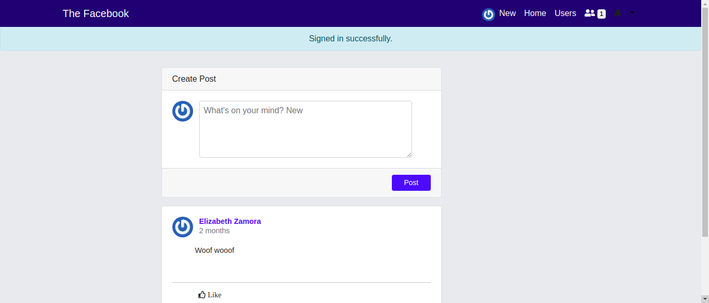

<h1 align="center">The Facebook</h1>
<p>
  
  <a href="https://github.com/ebukaume/the-facebook#readme" target="_blank">
    
  </a>
  <a href="https://github.com/ebukaume/the-facebook/graphs/commit-activity" target="_blank">
    
  </a>
  <a href="https://github.com/ebukaume/the-facebook/blob/master/LICENSE" target="_blank">
    
  </a>
  <a href="https://twitter.com/ebukaume" target="_blank">
    
</p>

<br>

<p>
  <a href="https://bookstore-react-redux.herokuapp.com" target="_blank">
    
  </a>
</p>

<br>

The project, the final project in the rails course, is part of a series of projects to be completed by students of [Microverse](https://www.microverse.org/ "The Global School for Remote Software Developers!").

The-facebook  started as collaborative project by [Denis Cuenca Brex](https://github.com/DenisCuencaBrex) and [Ebuka Umeokonkwo](https://github.com/ebukaume), but [Denis Cuenca Brex](https://github.com/DenisCuencaBrex) dropped out along the line due to issues with his computer system. In this project, we try to implement the basic functionalities of [Facebook](https://web.facebook.com "American online social media and social networking service company based in Menlo Park, California").

## Technologies

- Ruby 2.6.3
- Rails 5.2.3
- Postgresql >= 0.18  and < 2.0
- Bootstrap 4x

## Usage

The live version of the webapp can be found [here](https://the-facebook-rails.herokuapp.com)

> Clone the repository to your local machine

```sh
$ git clone https://github.com/ebukaume/the-facebook.git
```

> cd into the directory

```sh
$ cd the-facebook
$ bundle install
$ rails db:setup db:migrate
$ rails server
```

> You can run the specs by typing `rspec` and hitting ENTER anywhere inside the project directory.

> Using your favourite broswer, open: 

```sh
$ http://localhost:3000/
```

## Contributing

1. Fork it (https://github.com/ebukume/the-facebook/fork)
2. Create your feature branch (git checkout -b feature/[choose-a-name])
3. Commit your changes (git commit -am 'what this commit will fix/add')
4. Push to the branch (git push origin feature/[chosen-name])
5. Create a new Pull Request

## To-Do

1. Implement media upload - Active Storage
2. Implement real-time posts, comments and likes updates - Action Cable
3. Integrate mail notification - Action Mailer

## License

This project is licensed under the MIT License - see the [LICENSE](./LICENSE) file for details

## Contact me

I am looking for my next opportunity. Reach out to me if you are looking to hire!
_ebukaume@gmail.com_